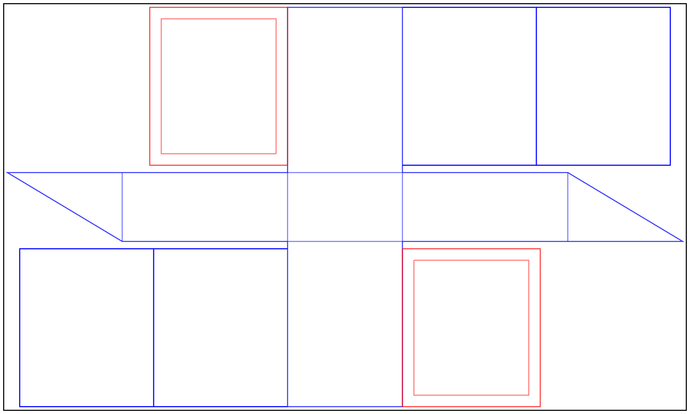

A diagonally zipped travel bag approx 15 x 25 x 36 cm with pockets on one or both sides.

## Bill of Materials:

- 1 yard of 60" canvas
- 1.5 40" zippers
- ~4 ft of nylon webbing
- a bunch of carpet / button thread

## Design

In the spirit of origami fold patterns, red lines are mountain folds and blue lines are valley folds.

`travelbag.hs` can also generate some variations for different measurements, it
uses the diagrams library for Haskell.

